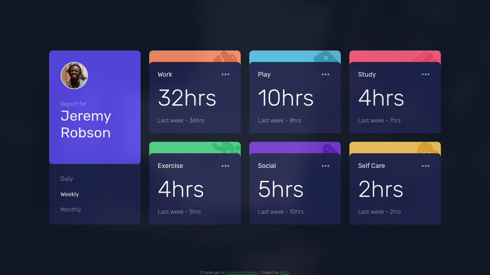

# Frontend Mentor - Time tracking dashboard solution

This is a solution to the [Time tracking dashboard challenge on Frontend Mentor](https://www.frontendmentor.io/challenges/time-tracking-dashboard-UIQ7167Jw). Frontend Mentor challenges help you improve your coding skills by building realistic projects.

## Table of contents

- [Overview](#overview)
  - [The challenge](#the-challenge)
  - [Screenshot](#screenshot)
  <!-- - [Links](#links) -->
- [My process](#my-process)
  - [Built with](#built-with)
  - [What I learned](#what-i-learned)
  - [Continued development](#continued-development)
  - [Useful resources](#useful-resources)
- [Author](#author)
- [Acknowledgments](#acknowledgments)

## Overview

### The challenge

Users should be able to:

- View the optimal layout for the site depending on their device's screen size
- See hover states for all interactive elements on the page
- Switch between viewing Daily, Weekly, and Monthly stats

### Screenshot



<!-- ### Links

- Solution URL: [Add solution URL here](https://your-solution-url.com)
- Live Site URL: [Add live site URL here](https://your-live-site-url.com) -->

## My process

### Built with

- Semantic HTML5 markup
- CSS custom properties
- Flexbox
- CSS Grid

### What I learned

I learnt quite a few things actually, the most important one being how to fetch data from an API (well the process is same as of fetching a local json file) and then changing the DOM based on that data.

This function below is what i'm the most proud of:-

```js
function updateData(json, timeframe) {
  const container = document.querySelector("#grid-container");

  json.forEach((element) => {
    container.innerHTML += `
    <div class="card ${element.title.replace(" ", "-").toLowerCase()}">
      <div class="card-content">
        <div class="card-top-bar">
          <div class="card-title">${element.title}</div>
          
        </div>
        <h1 class="card-time">${element.timeframes[timeframe].current}hrs</h1>
        <p class="subtle">Last ${
          timeframe === "daily"
            ? "day"
            : timeframe === "weekly"
            ? "week"
            : timeframe === "monthly"
            ? "month"
            : "error"
        } - ${element.timeframes[timeframe].previous}hrs</p>
      </div>
    </div>
    `;
  });
}
```

### Continued development

Working with APIs will be a must to stay in this field... so yeah i'll probably keep focusing on that in my future projects.

## Author

- Website - [!MAD!](http://imadi-arch.github.io/)
- Frontend Mentor - [@iMADi-ARCH](https://www.frontendmentor.io/profile/iMADi-ARCH)
- Twitter - [@iMADi69235681](https://twitter.com/iMADi69235681)
- LinkedIn - [Aditya Nandan](https://www.linkedin.com/in/aditya-nandan-thats-it/)

## Acknowledgments

Ty to [Vatsal](https://github.com/vatsalbansal123) for helping me :)
Go follow em.
